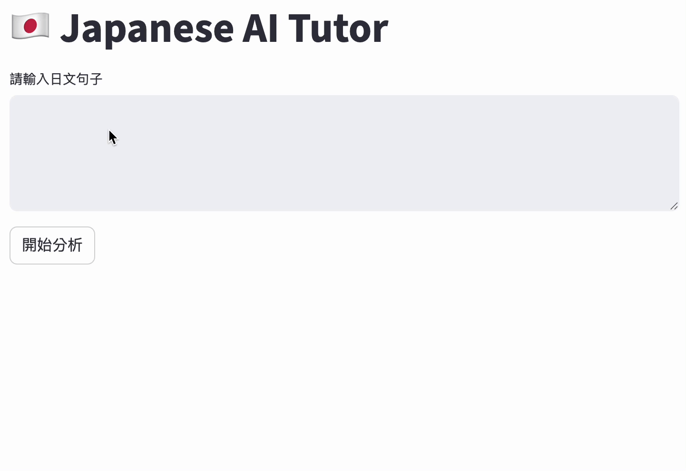

# 日文輔助系統 （ RAG + Rerank）
基於RAG的日文寫作輔助工具，修正日文句子、提供文法說明與正確的表達方式。

本專案聚焦於**系統設計與LLM模型協作流程**，整合了以下技術：

- 向量檢索（Vector Retrieval）
- CrossEncoder 的重排序（Reranking）
- 多模型支援（Gemini / Ollama）
- 串流式回應介面（Streaming Response UI）

---

## 專案目標
本專案的重點並非打造一個完美的文法檢查器，而是展示：

- 如何設計一個基於 RAG 的應用系統
- 如何透過重排序提升檢索品質
- 如何建立 LLM pipeline

---

## 系統架構
使用者輸入  
↓  
向量資料庫檢索（Top-K）  
↓  
信心分數過濾  
↓  
CrossEncoder（Reranking）  
↓  
選出前 2 條文法規則  
↓  
LLM 生成（Gemini / Ollama）  
↓  
Streamlit 使用者介面輸出

---

## 核心功能

### 1. 基於 RAG 的文法檢索

透過向量搜尋，從預先建立的資料集中檢索相關文法規則。

### 2. 信心分數過濾

利用相似度分數門檻篩除低相關規則，以降低雜訊干擾。

### 3. CrossEncoder的重排序

使用bge重排序模型，提升匹配度。

### 4. 多模型支援

可切換不同模型來源：

Google Gemini / Ollama 本地模型

### 5. 串流式介面

透過 Streamlit 提供即時回應串流，提升使用者體驗。

--- 

## 執行方式

### 1. 設定 config.py
在 `config.py` 中設定相關參數，例如：

```python
# LLM 模型設定
LLM_PROVIDER = "gemini"  # or "ollama"

# Gemini 設定
GEMINI_API_KEY = "your_api_key"
GEMINI_MODEL = "gemini-2.5-flash"

# Ollama 設定
OLLAMA_MODEL = "phi3"

# 向量檢索設定
TOP_K = 5
SIMILARITY_THRESHOLD = 0.75
```

### 2. 安裝套件

```bash
pip install -r requirements.txt
```

### 3. 建立db build_db.py

```python
python build_db.py
```

### 3. 啟動 Ollama（如果使用）

```bash
ollama run llama3
```

### 4. 啟動 Streamlit

```bash
streamlit run app.py
```
---


## 限制與未來改進方向

### 檢索中的語意 vs 語法不匹配問題
目前系統採用基於 embedding 的語意檢索來取得文法規則，但在日文文法修正本質上更接近語法錯誤對應問題，而非單純的語意相似度匹配。

因此會出現以下情況：

- 檢索結果在語意上相似
- 但實際上並不對應真正的文法錯誤類型

例如：

- 系統可能找到「相近句意」的規則
- 但該規則並不適用於助詞或動詞變化錯誤

### 未來方向

為了解決上述問題，未來可朝以下方向優化：

- 引入文法錯誤分類層（particle / verb / sentence structure）
- 將檢索機制從「語意相似度」轉為「錯誤類型感知篩選」
- 強化規則表示方式，加入結構化 metadata，例如：  
error type（錯誤類型）  
examples（正確/錯誤例句）  
applicable context（適用語境）

---

## Demo




---

## 備註
本專案是一個以學習為導向的 AI 應用實作，主要探索：

- RAG 系統設計
- LLM 協作流程模式（Orchestration Patterns）
- 準確率、成本與延遲之間的取捨平衡